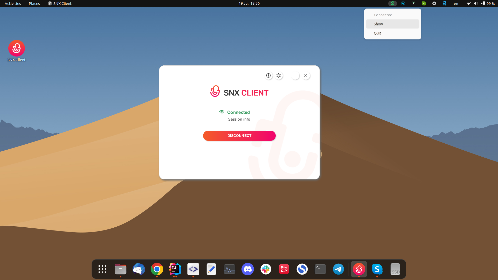
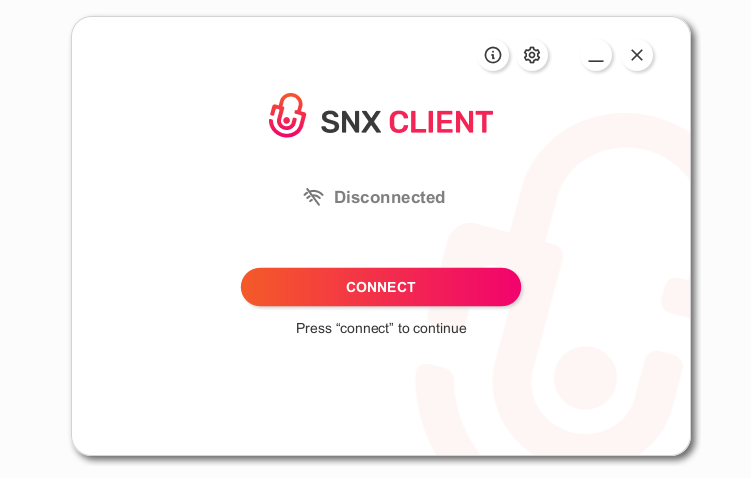
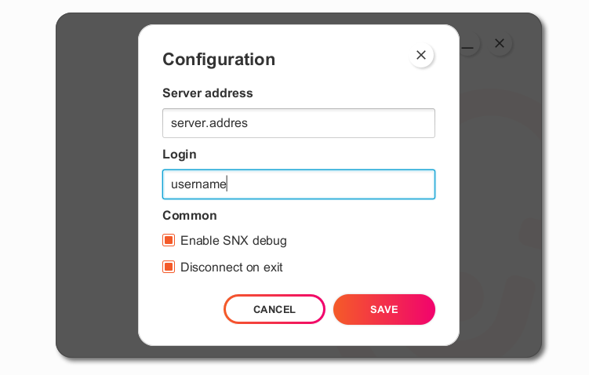
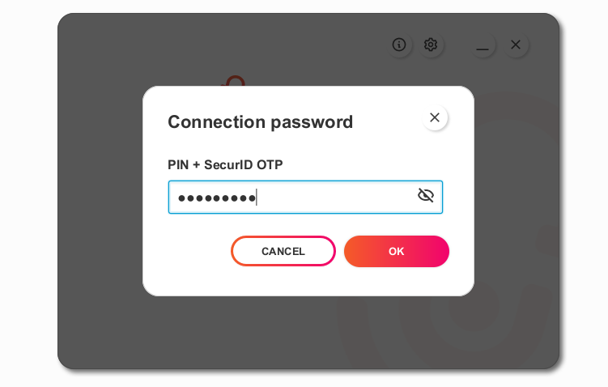
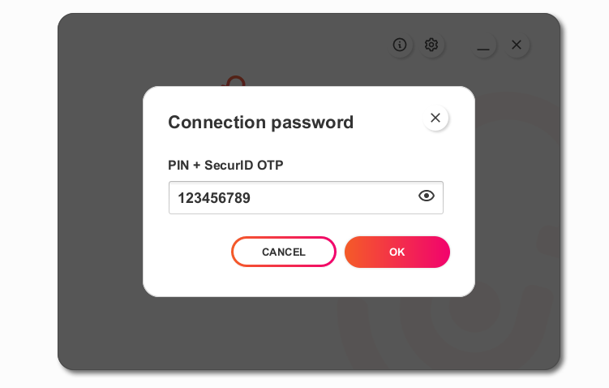
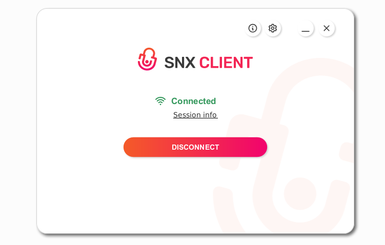
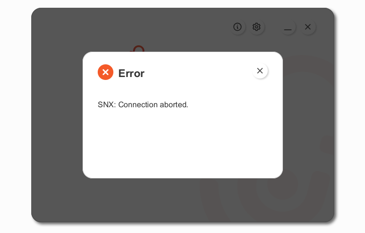
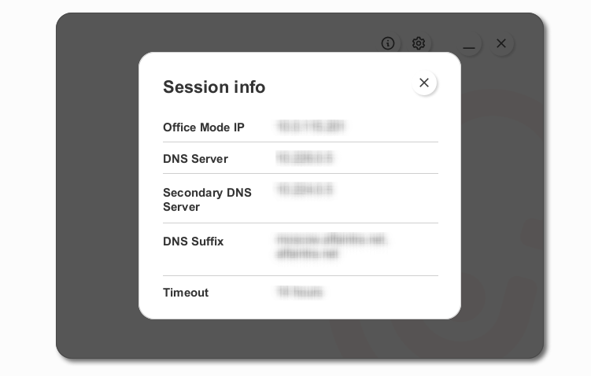
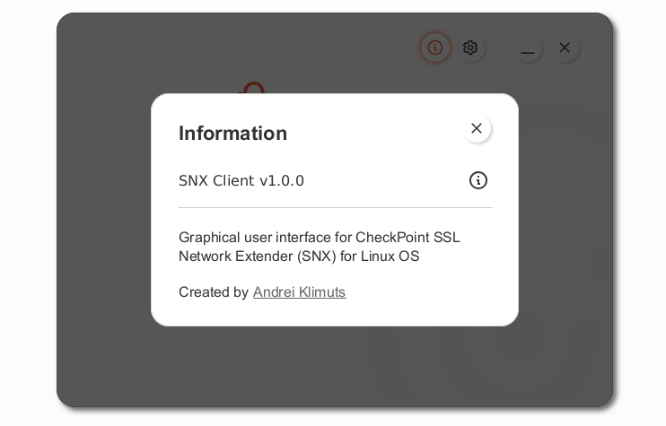
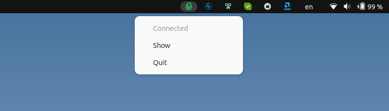

# SNX Client v1.0.4

Graphical user interface for CheckPoint SSL Network Extender (SNX) for Ubuntu.

  

# Table of contents

- [Description](#description)
- [Problems and Restrictions](#problems-and-restrictions)
- [Usage](#usage)
    * [Main window](#main-window)
    * [Configuration](#configuration)
    * [Connection](#connection)
    * [Session info](#session-info)
    * [About](#about)
    * [Tray](#tray)
- [Installation](#installation)
- [Uninstallation](#uninstallation)
- [Acknowledgments](#acknowledgments)
- [Contributing](#contributing)
- [License](#license)

# Description

SNX Client is not a full-fledged VPN client. It is the graphical user interface for CheckPoint SSL Network Extender (SNX) for Ubuntu.  
The SNX Client is designed to make it easy to start, configure, connect, and display the status of a VPN connection. The
application requires the SNX with all its dependencies to be installed on the system first,
see [Installation](#installation)

# Problems and Restrictions

If you have not used SNX before, after installing it, the first connection must be made from the command line, using standard SNX commands.
This is due to the fact that confirmation screens for certificate import are not yet implemented.

# Usage

[(Back to top)](#table-of-contents)

## Main window

Launch the program by double-clicking the shortcut on the desktop or in Applications.

  
**Buttons description:**
<table>
  <tr>
    <td></td>
    <td>Opens about window</td>
  </tr>
  <tr>
    <td></td>
    <td>Opens application configuration window</td>
  </tr>
  <tr>
    <td></td>
    <td>Minimizes the application window</td>
  </tr>
  <tr>
    <td></td>
    <td>Closes the application window (the application is still running and available in the tray)</td>
  </tr>
  <tr>
    <td>(CONNECT)</td>
    <td>Establishes/terminates connection. The name of the button changes depending on the connection status to CONNECT or DISCONNECT</td>
  </tr>
  <tr>
    <td><ins>Sessin info</ins></td>
    <td>Displays information about the connection</td>
  </tr>
</table>

## Configuration
Open application configuration window  
Enter and save the server address and user name before connecting

`[*] Enable SNX Debug` - if selected, will create snx.elg.x log files in the user's home directory  
`[*] Disconnect on exit` - if selected, the connection will be automatically terminated when the application is closed

## Connection

Press the `CONNECT` button, the password input window opens

 - press to unmask the password, if necessary

Press `OK` to start connection. A terminal window will open, do not close this window, it will be closed automatically
when the connection is established

If the connection is successful, the main screen will look like the screenshot below

If any connection error occurs, the corresponding message will be displayed on the screen

### Session info

Press the `Sessin info` button on the connected window, a window with session information will open

### About info
Open about window

## Tray

The icon in the tray has a different color depending on the connection status.  
Connection status is also displayed at the top of the tray menu

Press `Show` to open the main window  
Press `Quit` to terminate the application

# Installation

[(Back to top)](#table-of-contents)

CheckPoint SNX Installation Package for Linux OS must be installed
first

To install SNX Client, unzip the application archive **snx-client-v1.x.x.zip** into a convenient directory  
Go into this directory, run the install file from the console

`$ ./install`

Or for Ubuntu, right-click on `install` file and select "Run As Program".

This will generate a shortcut for quick launch (`snxgui.desktop`), create service files and startup scripts. The shortcut will be automatically placed on the desktop and in Applications

# Uninstallation

[(Back to top)](#table-of-contents)

Go into application directory, run the uninstall file from the console

`$ ./uninstall`

Or for Ubuntu, right-click on uninstall file and select "Run As Program".

This script will automatically remove shortcuts from the desktop and from Applications, and remove service files.

# Acknowledgments

[(Back to top)](#table-of-contents)

* [Kseniya German](mailto:kseniya_herman@senla.eu) - UX and UI design
* [Aliaksandr Aleinik]() - UX ideas

# Contributing

[(Back to top)](#table-of-contents)

Your contributions are always welcome! Please have a look at the [contribution guidelines](CONTRIBUTING.md) first.

# License

[(Back to top)](#table-of-contents)

The MIT License (MIT) 2022 - [Andrei Klimuts](https://github.com/klimuts). Please have a look at
the [LICENSE.md](LICENSE.md) for more details.
